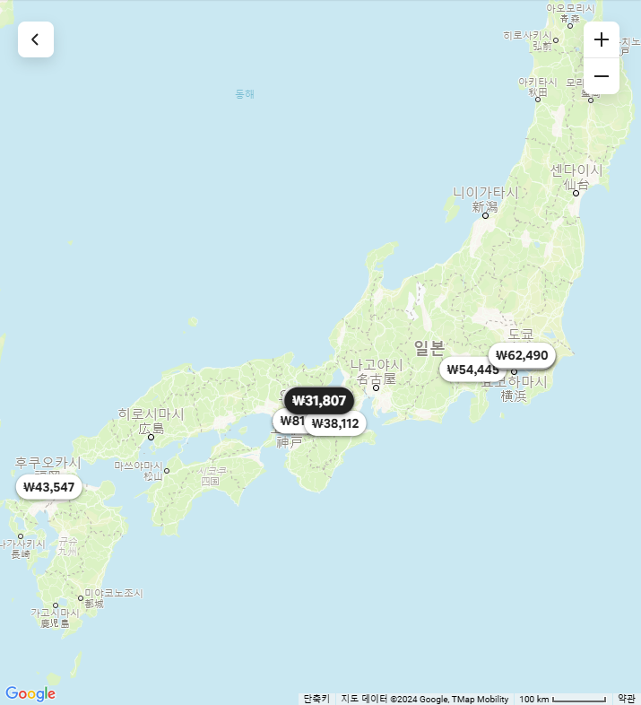
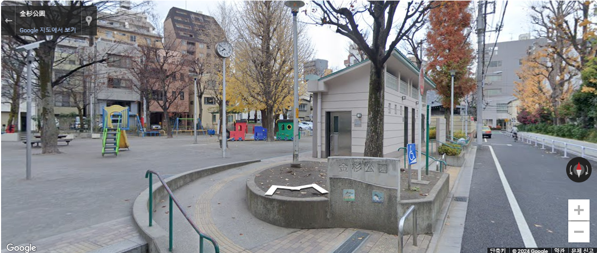
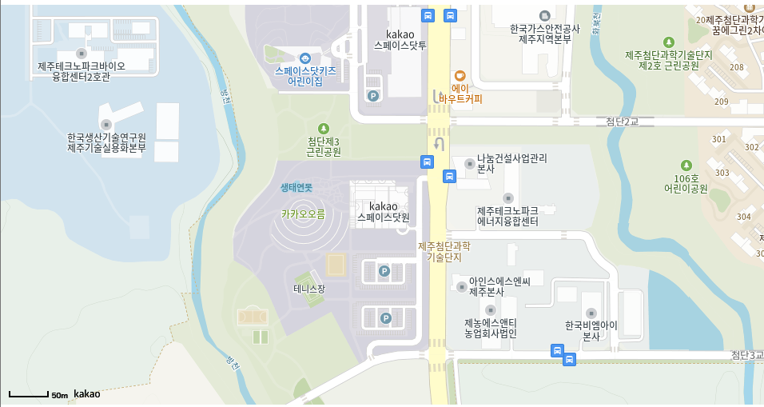
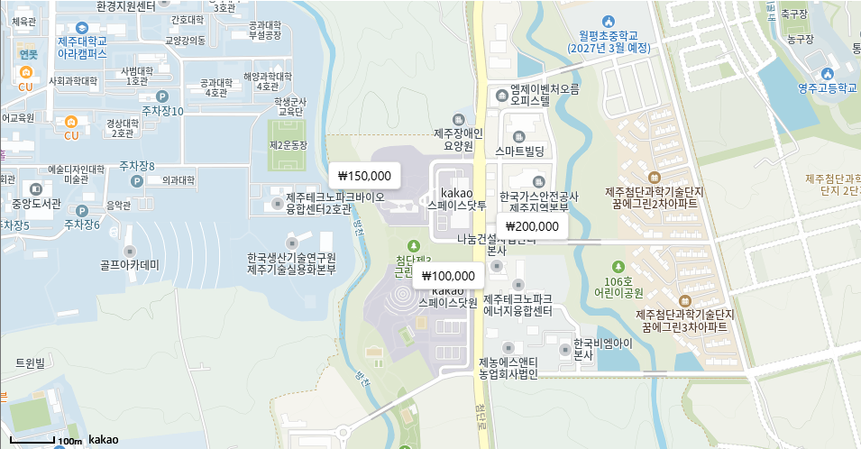
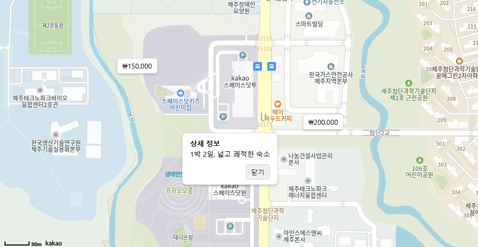

---

layout: single
title: "카카오 지도 만들기"
toc: true
typora-root-url: ../

---

# 목표

에어비앤비에서 사용되는 지도를 카카오지도 api를 이용하여 구현할 것이다.


1. 전체 지도



* 지도 띄우기
* 지도에 가격대 오버레이 띄우기
* 오버레이 클릭 시 상세정보 표시
* 지도 레벨에 따라 일정 수의 오버레이 랜덤으로 띄우기
* 행정구역에 맞게 지도 레벨 조절하기


2. 상세 지도




* 지도에 숙소 위치 띄우기
* 숙소 주변에 있는 숙소 및 장소 리스트로 뽑기(반경 5km)
* 로드뷰 만들기

# 카카오 지도 api 사용하기

1. 카카오 개발자 사이트에서 앱 등록 후 app key 발급받기
2. react 프로젝트 생성 및 카카오 지도 api 사용

```bash
npx create-react-app kakao-mapp
cd kakao-map
npm start
```

(이미 react 프로젝트가 있는 경우 생략)


발급받은 app key는 public/index.html의 head 섹션에 추가한다.

```html
<!DOCTYPE html>
<html lang="ko">
  <head>
    <meta charset="UTF-8" />
    <meta name="viewport" content="width=device-width, initial-scale=1.0" />
    <title>카카오 지도</title>
    <!-- 카카오 지도 SDK -->
    <script
      type="text/javascript"
      src="https://dapi.kakao.com/v2/maps/sdk.js?appkey=YOUR_APP_KEY&libraries=services"
    ></script>
  </head>
  <body>
    <div id="root"></div>
  </body>
</html>
```

위의 YOUR_APP_KEY 부분을 카카오 개발자 사이트에서 발급받은 실제 JavaScript 키로 바꿔준다.

3.  src/App.js에 <KakaoMap/>을 넣고 page/KakaoMapPage.js에서 이제 작업을 한다.

```react
import React from "react";
import KakaoMap  from "./page/KakaoMapPage";

const App = () => {
  return (
    <div>
      <h1>카카오 지도 예제</h1>
      <KakaoMap  />
    </div>
  );
};

export default App;
```


# 전체지도

## 지도 띄우기

```react
import React, { useEffect, useRef } from 'react';

const KakaoMap = () => {
  const mapContainer = useRef(null); // 지도 div를 참조하기 위한 useRef

  useEffect(() => {
    const { kakao } = window;
    // 지도 초기화
    const options = {
      center: new kakao.maps.LatLng(33.450701, 126.570667), // 초기 지도 중심 좌표
      level: 3, // 확대 레벨
    };
    new kakao.maps.Map(mapContainer.current, options); // 지도 객체 생성
  }, []);

  return <div ref={mapContainer} style={{ width: '100%', height: '500px' }}></div>;
};

export default KakaoMap;
```



### React 훅 (useEffect와 useRef) 사용

useRef

```react
const mapContainer = useRef(null);
```

* useRef는 Reac에서 DOM 요소나 변수를 참조할 수 있게 해주는 훅이다. 이 코드에서는 MapContainer라는 변수를 useRef로 생성하여, 카카오 지도를 표시할 div 요소를 참조할 수 있도록 한다.
* mapContainer.current는 실제 DOM 요소인 div를 가리키며, 이를 통해 카카오 지도 API가 그려질 위치를 지정한다.


useEffect

```react
useEffect(() => {
  const { kakao } = window;
  // 지도 초기화
  const options = {
    center: new kakao.maps.LatLng(33.450701, 126.570667), // 초기 지도 중심 좌표
    level: 3, // 확대 레벨
  };
  new kakao.maps.Map(mapContainer.current, options); // 지도 객체 생성
}, []);

```

* useEffect는 컴포넌트가 렌더링된 후 특정 작업을 수행할 수 있게 해주는 훅이다. 이 코드에서는 useEffect를 사용하여 카카오 지도 API를 불러오고, 지도 객체를 생성한다.
* 빈 배열 []을 두 번째 인자로 넘기면, 이 useEffect 훅은 컴포넌트가 처음 렌더링될 때만 실행된다. 즉, 지도는 페이지가 처음 로드될 때 한 번만 초기화된다.

### 카카오 지도 초기화

```javascript
const { kakao } = window;
```

* 이 코드에서는 window 객체에서 kakao 객체를 가져온다. 카카오 지도 API는 window.kakao 객체로 제공되기 때문에 이를 참조하여 사용한다.

options 객체

```javascript
const options = {
  center: new kakao.maps.LatLng(33.450701, 126.570667), // 초기 지도 중심 좌표
  level: 3, // 확대 레벨
};
```

* options 객체는 카카오 지도 API에 전달할 설정 값들이다.
  - center: 지도의 초기 중심 좌표 설정
  - level: 지도 확대 레벨 설정


지도 객체 생성

```javascript
new kakao.maps.Map(mapContainer.current, options);
```

* new kakao.maps.Map()을 사용하여 카카오 지도 객체를 생성한다. 이 함수의 첫 번째 인자는 지도를 표시할 DOM 요소이고 두 번째 인자는 지도 설정을 담은 options 객체이다.
* mapContainer.current는 앞에서 정의한 useRef로, 이 div 요소에 지도가 렌더링된다.

### JSX 반환

```jsx
return <div ref={mapContainer} style={{ width: '100%', height: '500px' }}></div>;
```

* JSX 코드에서 <div> 태그는 카카오 지도를 표시할 컨테이너 역할을 한다.
* ref={mapContainer}를 통해 이 div 요소는 mapContainer라는 useRef로 참조된다. 이 참조를 통해 카카오 지도는 이 div 안에 그려진다.
* style={{ width: '100%', height: '500px' }}는 이 div의 크기를 설정하는 스타일이다. width: '100%'는 화면 크기에 맞게 div의 너비를 설정하고, height: '500px'는 고정 높이를 설정한다.


### 전체 코드 흐름 요약

1. useRef로 div 요소를 참조한다. 이 div가 카카오 지도가 표시될 컨테이너이다.
2. useEffect로 컴포넌트가 처음 렌더링될 때 카카오 지도 API르르 사용하여 지도를 초기화한다. 초기 좌표와 확대 레젤을 설정한다.
3. kakao.maps.Map을 사용하여 지도 객체를 생성하고, 이를 mapContainer.current에 표시한다.
4. div 요소에 지도가 그려진다. 이 div는 style을 통해 크기를 지정하고, ref = {mapContainer}로 참조된다.


## 지도에 가격대 오버레이 띄우기

```jsx
import React, { useEffect, useRef } from 'react';

const KakaoMap = () => {
  const mapContainer = useRef(null); // 지도 div를 참조하기 위한 useRef

  useEffect(() => {
    const { kakao } = window;
    
    // 지도 초기화
    const options = {
      center: new kakao.maps.LatLng(33.450701, 126.570667), // 초기 지도 중심 좌표
      level: 3, // 확대 레벨
    };
    const map = new kakao.maps.Map(mapContainer.current, options); // 지도 객체 생성

    // 가격대 오버레이 추가
    const positions = [
      { lat: 33.450701, lng: 126.570667, price: '₩100,000' },
      { lat: 33.451701, lng: 126.572667, price: '₩200,000' },
      { lat: 33.452701, lng: 126.568667, price: '₩150,000' },
    ];

    positions.forEach(({ lat, lng, price }) => {
      // HTML 내용 생성
      const content = `<div style="
        padding: 5px 10px; 
        background: white; 
        border: 1px solid #ddd; 
        border-radius: 5px;
        box-shadow: 0 2px 4px rgba(0,0,0,0.2);
        font-size: 14px;">
        ${price}
      </div>`;

      // 커스텀 오버레이 생성
      const overlay = new kakao.maps.CustomOverlay({
        position: new kakao.maps.LatLng(lat, lng),
        content: content,
        yAnchor: 1, // 오버레이의 Y축 기준점을 아래로 설정
      });

      // 지도에 오버레이 추가
      overlay.setMap(map);
    });
  }, []);

  return <div ref={mapContainer} style={{ width: '100%', height: '500px' }}></div>;
};

export default KakaoMap;

```




### positions 배열

```jsx
const positions = [
  { lat: 33.450701, lng: 126.570667, price: '₩100,000' },
  { lat: 33.451701, lng: 126.572667, price: '₩200,000' },
  { lat: 33.452701, lng: 126.568667, price: '₩150,000' },
];
```

* positions는 가격대를 표시할 위치와 가격 정보를 담고 있는 배열이다.
* 각 항목은 위도, 경도, 그리고 표시할 가격 문자열로 구성된다.


### HTML 내용 생성

```javascript
const content = `<div style="
  padding: 5px 10px; 
  background: white; 
  border: 1px solid #ddd; 
  border-radius: 5px;
  box-shadow: 0 2px 4px rgba(0,0,0,0.2);
  font-size: 14px;">
  ${price}
</div>`;
```

* 각 가격을 HTML로 만들어 오버레이에 표시한다.
* HTML 요소는 스타일을 적용하여 카드 형태로 만들었다.


kakao.maps.CustomOverlay

```javascript
const overlay = new kakao.maps.CustomOverlay({
  position: new kakao.maps.LatLng(lat, lng),
  content: content,
  yAnchor: 1, // Y축 기준점을 아래쪽으로 설정
});
```

* CustomOverlay를 사용하여 HTML 콘텐츠를 지도 위에 표시한다.
* position은 오버레이가 표시될 지도 상의 좌표이다.
* content는 표시할 HTML이다.
* yAnchor는 오버레이의 Y축 기준점을 설정한다. 1로 설정하면 오버레이가 기준 좌표의 바로 위에 표시된다.


### 지도에 오버레이 추가

```javascript
overlay.setMap(map);
```

* setMap 메서드를 사용하여 오버레이를 지도에 추가한다.


### 결과

* 지도에는 지정된 위치에 각 가격대가 표시된다.
* 가격대는 HTML 콘텐츠로 표시되므로, 필요한 경우 CSS를 추가하여 더 복잡한 스타일링을 적용할 수 있다.


## 오버레이 클릭 시 상세정보 표시

```jsx
import React, { useEffect, useRef } from "react";

const KakaoMap = () => {
  const mapContainer = useRef(null); // 지도 div를 참조하기 위한 useRef
  const openOverlayRef = useRef(null); // 현재 열려 있는 상세정보 오버레이를 추적

  useEffect(() => {
    const { kakao } = window;

    // 지도 초기화
    const options = {
      center: new kakao.maps.LatLng(33.450701, 126.570667), // 초기 지도 중심 좌표
      level: 3, // 확대 레벨
    };
    const map = new kakao.maps.Map(mapContainer.current, options); // 지도 객체 생성

    // 가격대 정보
    const positions = [
      { lat: 33.450701, lng: 126.570667, price: "₩100,000", details: "1박 2일, 넓고 쾌적한 숙소" },
      { lat: 33.451701, lng: 126.572667, price: "₩200,000", details: "럭셔리한 숙소, 해변 근처" },
      { lat: 33.452701, lng: 126.568667, price: "₩150,000", details: "조용한 동네, 프라이빗 공간" },
    ];

    positions.forEach(({ lat, lng, price, details }) => {
      // 가격대 오버레이 HTML 생성
      const priceContent = document.createElement("div");
      priceContent.innerHTML = price;
      priceContent.style.cssText = `
        padding: 5px 10px; 
        background: white; 
        border: 1px solid #ddd; 
        border-radius: 5px;
        box-shadow: 0 2px 4px rgba(0,0,0,0.2);
        font-size: 14px;
        cursor: pointer;
      `;

      // 상세정보 오버레이 HTML 생성
      const detailContent = document.createElement("div");
      detailContent.innerHTML = `
        <div style="
          padding: 10px 15px;
          background: white;
          border: 1px solid #ddd;
          border-radius: 8px;
          box-shadow: 0 2px 4px rgba(0,0,0,0.2);
          font-size: 14px;
          max-width: 200px;
          line-height: 1.5;">
          <strong>상세 정보</strong><br>${details}
          <div style="margin-top: 10px; text-align: right;">
            <button style="
              padding: 5px 10px; 
              background: #f0f0f0; 
              border: 1px solid #ccc; 
              border-radius: 5px; 
              cursor: pointer;">닫기</button>
          </div>
        </div>
      `;

      // 상세정보 오버레이 생성
      const detailOverlay = new kakao.maps.CustomOverlay({
        position: new kakao.maps.LatLng(lat, lng),
        content: detailContent,
        yAnchor: 1,
        zIndex: 3,
      });

      detailOverlay.setMap(null); // 처음에는 숨김

      // 가격대 오버레이 생성
      const priceOverlay = new kakao.maps.CustomOverlay({
        position: new kakao.maps.LatLng(lat, lng),
        content: priceContent,
        yAnchor: 1,
      });

      // 가격대 오버레이 클릭 이벤트
      priceContent.addEventListener("click", () => {
        // 이전에 열려 있는 오버레이 닫기
        if (openOverlayRef.current) {
          openOverlayRef.current.setMap(null);
        }

        // 현재 오버레이를 열고, 열려 있는 오버레이를 갱신
        detailOverlay.setMap(map);
        openOverlayRef.current = detailOverlay;
      });

      // 닫기 버튼 이벤트: 상세정보 오버레이를 닫음
      const closeButton = detailContent.querySelector("button");
      closeButton.addEventListener("click", () => {
        detailOverlay.setMap(null); // 현재 상세정보 오버레이 숨김
        openOverlayRef.current = null; // 열려 있는 오버레이 상태 초기화
      });

      // 지도에 가격대 오버레이 추가
      priceOverlay.setMap(map);
    });
  }, []);

  return <div ref={mapContainer} style={{ width: "100%", height: "500px" }}></div>;
};

export default KakaoMap;

```



1. 가격대 클릭 시 상세정보 표시
2. 다른 가격대를 클릭하면 이전의 상세정보는 자동으로 닫히고 새로운 상세정보 표시


```jsx
const openOverlayRef = useRef(null); // 현재 열려 있는 상세정보 오버레이를 추적
```

현재 열려 있는 상세정보 오버레이를 추적하여, 새로운 오버레이가 열릴 때 이전 오버레이를 닫는다.


### 가격대와 상세정보 데이터 정의

```jsx
const positions = [
  { lat: 33.450701, lng: 126.570667, price: "₩100,000", details: "1박 2일, 넓고 쾌적한 숙소" },
  { lat: 33.451701, lng: 126.572667, price: "₩200,000", details: "럭셔리한 숙소, 해변 근처" },
  { lat: 33.452701, lng: 126.568667, price: "₩150,000", details: "조용한 동네, 프라이빗 공간" },
];

```

* 위의 가격대 리스트에 상세정보를 포함시킨다.


### 클릭 가능한 가격대 오버레이 생성

```javascript
const priceContent = document.createElement("div");
priceContent.innerHTML = price;
priceContent.style.cssText = `
  padding: 5px 10px; 
  background: white; 
  border: 1px solid #ddd; 
  border-radius: 5px;
  box-shadow: 0 2px 4px rgba(0,0,0,0.2);
  font-size: 14px;
  cursor: pointer;
`;
```

* DOM 요소를 동적으로 생성하여 가격 정보를 표시한다.
* 클릭 가능한 스타일(cursor: pointer)을 적용한다.


### 상세정보 오버레이 생성

```javascript
const detailContent = document.createElement("div");
detailContent.innerHTML = `
  <div style="
    padding: 10px 15px;
    background: white;
    border: 1px solid #ddd;
    border-radius: 8px;
    box-shadow: 0 2px 4px rgba(0,0,0,0.2);
    font-size: 14px;
    max-width: 200px;
    line-height: 1.5;">
    <strong>상세 정보</strong><br>${details}
    <div style="margin-top: 10px; text-align: right;">
      <button style="
        padding: 5px 10px; 
        background: #f0f0f0; 
        border: 1px solid #ccc; 
        border-radius: 5px; 
        cursor: pointer;">닫기</button>
    </div>
  </div>
`;
```

* HTML 콘텐츠를 동적으로 생성하여 상세정보를 표시한다.
* "닫기" 버튼을 포함하여 동작을 제어한다.


### 가격대 오버레이 클릭 이벤트

```javascript
priceContent.addEventListener("click", () => {
  if (openOverlayRef.current) {
    openOverlayRef.current.setMap(null); // 기존 오버레이 닫기
  }
  detailOverlay.setMap(map); // 새 오버레이 열기
  openOverlayRef.current = detailOverlay; // 열려 있는 오버레이 갱신
});
```

* 클릭 시
  1. openOverlayRef를 확인해 이미 열려 있는 오버레이를 닫는다.
  2. 새로운 오버레이를 열고 openOverlayRef를 갱신한다.


### 상세정보 오버레이 닫기 버튼 이벤트

```javascript
closeButton.addEventListener("click", () => {
  detailOverlay.setMap(null); // 오버레이 닫기
  openOverlayRef.current = null; // 열려 있는 오버레이 초기화
});
```

* "닫기" 버튼을 클릭하면 오버레이를 닫고, openOverlayRef를 초기화한다.


